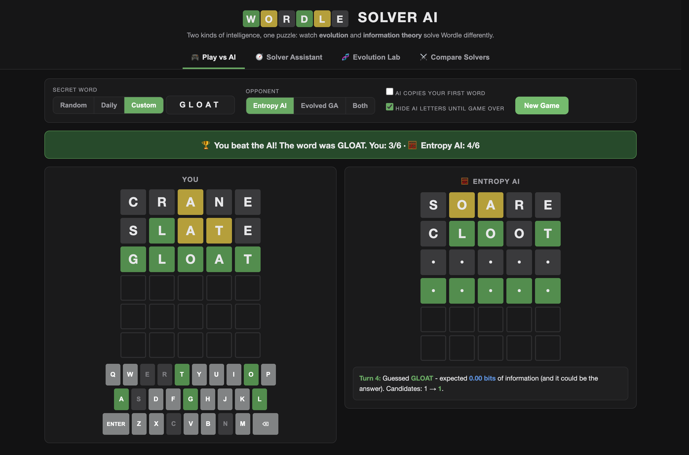
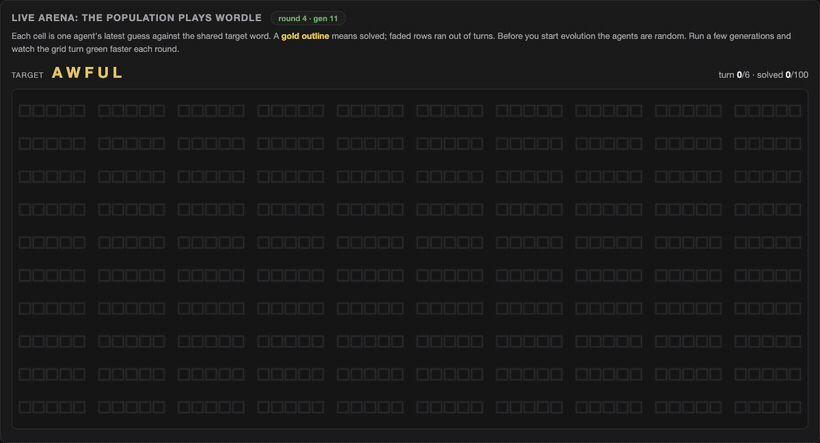
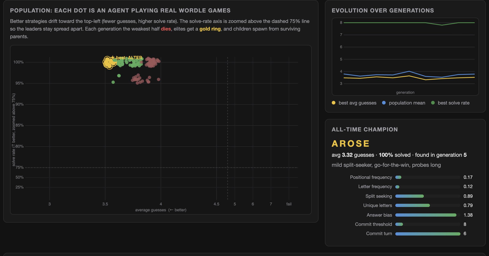
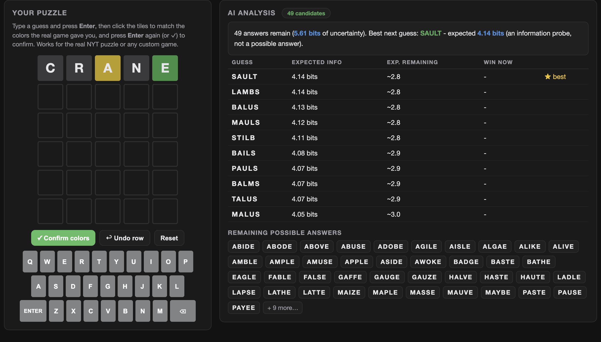
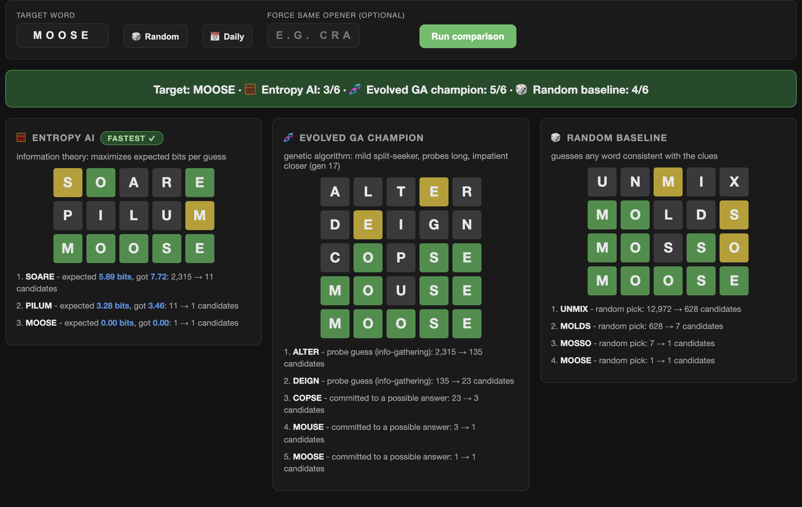

# Wordle Solver AI

Two ways to crack the same puzzle: an **information-theory solver** that computes the mathematically best guess, and a **genetic algorithm** that starts from a population of random strategies and *evolves* its way to nearly the same skill — without ever being taught the math.

**▶ [Play with it here](https://sane24.github.io/NYT-Wordle-Solver-AI/)** — runs entirely in your browser, nothing to install.



## The fun part: watching evolution happen live

The Evolution Lab runs a real genetic algorithm in your browser. A population of ~100 agents plays actual Wordle games every generation; the weakest half dies, elites survive, parents crossbreed, children mutate. Below is generation 11 solving a shared target — every one of the 100 agents lands the word within four guesses. Ten generations earlier, most of them couldn't solve it at all.



Each dot in the population view is one agent, plotted by average guesses vs. solve rate. You can watch the cloud drift toward the top-left corner as better strategies take over:



## Results

Measured on the full 2,315-word answer list:

| Solver | Avg guesses | Solve rate |
|---|---|---|
| Entropy AI | 3.46 | 100% |
| Evolved GA champion | 3.65 | 99.2% |
| Random consistent guesser | ~5 | ~85% |

The gap between the two is the interesting number: evolution gets within ~0.2 guesses of the information-theoretic approach purely by selection pressure, with no entropy math anywhere in its genome.

## How the two solvers work

### The entropy solver

For a guess *G* over a candidate set *C*, the 243 possible green/yellow/gray feedback patterns partition *C* into buckets. The expected information of the guess is

```
H(G) = log2|C| − (1/|C|) · Σ n_b · log2(n_b)
```

The solver plays the guess with the highest H, tie-breaking toward words that could themselves be the answer (they can win outright). This is why it opens with strange words like SOARE — it's not trying to *guess* the answer early, it's trying to *learn* the most. First-move entropies over the whole dictionary are precomputed so the site loads fast.

### The genetic solver

An agent's genome is just 7 numbers: weights for positional letter frequency, overall letter frequency, split-seeking (preferring letters that appear in ~50% of remaining candidates), unique letters, answer bias — plus a *commit threshold* and *commit turn* that decide when to stop probing for information and start actually trying to win.

Fitness is the penalty-adjusted average guess count over a fresh sample of real games each generation. Selection is tournament-based with elitism, uniform/blend crossover, Gaussian mutation, and a few random immigrants per generation to keep the gene pool from stagnating.

My favorite result: high split-seeking weights keep winning, generation after generation. That's the 50/50 partition idea at the heart of information theory — rediscovered by evolution, without anyone writing down a logarithm.

## Also in the box

**A solver assistant** for your own games. Mirror any Wordle (including the real NYT one) by typing your guess and clicking the tiles to match the colors you got. The engine tells you how many answers remain, how many bits of uncertainty are left, and the best next guesses, ranked by expected information:



**A head-to-head mode** that races every solver on the same word and shows their full reasoning traces side by side. Watching the GA champion stumble from MOUSE to MOOSE while the entropy solver nails it in 3 tells you more about the two approaches than any chart:



**A Discord bot** ([`bot/`](bot/)) that wraps the same solver core in slash commands: `/wordle play` to race the AI, `/wordle hint` for help with any position, `/wordle solve`, `/wordle compare`, and a `/wordle daily` puzzle.

## Under the hood

- **Vanilla JavaScript, no framework, no build step.** The site is plain ES modules served statically; the only npm dependency in the whole repo is discord.js for the bot.
- **The solver core is isomorphic** — [`core/`](core/) has zero DOM or Node dependencies, so the exact same entropy and GA code runs in the browser, in web workers, in Node scripts, and in the Discord bot.
- **The hot path is cache-friendly.** The inner loop everywhere is "feedback of guess G vs. every possible answer," so [`core/tables.js`](core/tables.js) caches one `Uint8Array` row per guess (each pattern fits in a byte) and represents candidate sets as `Int32Array` indices. Filtering candidates becomes a table lookup instead of string comparison.
- **Nothing blocks the UI.** Entropy ranking and GA generations run in web workers behind a small promise-based RPC shim ([`js/worker-rpc.js`](js/worker-rpc.js)).
- **The daily puzzle is deterministic** — an FNV-1a hash of the date over the public answer list, so the website and the Discord bot agree on the same word with no server and no NYT scraping.

## Run it locally

```bash
git clone https://github.com/Sane24/NYT-Wordle-Solver-AI.git
cd NYT-Wordle-Solver-AI
npm run serve        # website at http://localhost:8917
```

Offline tooling:

```bash
npm run evolve       # run evolution headless, write the best genome to core/champion.js
npm run benchmark    # score both solvers (add -- --full for all 2,315 answers)
npm run precompute   # regenerate first-move entropies in core/openers.js
```

For the Discord bot, copy [`bot/.env.example`](bot/.env.example) to `bot/.env`, fill in your bot token, then:

```bash
npm run bot:deploy   # register the slash commands once
npm run bot
```

## Project layout

```
core/       solver engine (pure JS, no DOM/Node deps)
  feedback.js    pattern encoding: 5 tiles → one byte, base 3
  entropy.js     information-theory solver
  genetic.js     genomes, fitness, selection, crossover, mutation
  tables.js      typed-array lookup tables for the hot path
  daily.js       deterministic daily word
js/         website: tab router, boards, workers
scripts/    offline evolve / benchmark / precompute
bot/        Discord bot (discord.js)
```

## Notes

- Word lists are the public Wordle answer list (2,315 words) and legal-guess list (12,972). The daily word here is intentionally **not** the official NYT word, so nothing gets spoiled.
- Custom words outside the answer list work everywhere — the solvers detect it and fall back to the full legal-guess dictionary.
